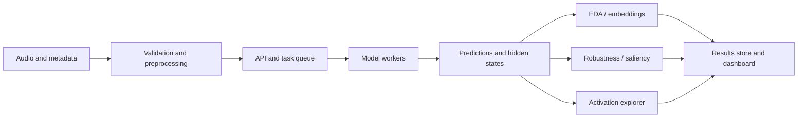

# In22-S5-CS3501 Data Science and Engineering Project

## Visual Interpretability and Diagnostic Tool for Speech Models

**Group ID:** 16  
**Project ID:** P01  
**Mentor:** Dr. Uthayasanker Thayasivam  
**Teaching Assistant:** Bawantha Madhushankha De Silva

| Team member | Registration number |
|---|---|
| LELWALA J.U.P. | 230374E |
| MAHANAMA K.J.C. | 230387V |
| MALLAWARACHCHI H.S. | 230394N |

## 1. Executive summary

Speech models such as Whisper and Wav2Vec2 achieve strong results in automatic speech recognition (ASR) and audio classification, but their decisions remain difficult to inspect. Speech is especially challenging for explainability because it is a variable-length temporal signal containing linguistic content, speaker characteristics, background conditions, and paralinguistic information. A wrong transcription may originate from poor recording quality, accent variation, incorrect acoustic encoding, excessive decoder reliance on language context, or a spurious dataset pattern.

The existing ECHO prototype provides audio upload, prediction, saliency, attention, embeddings, and perturbations. However, its expensive analyses are executed through a largely sequential workflow, its visualizations are mainly file-level, and their reliability is not quantitatively evaluated. This project will extend ECHO into a scalable diagnostic workbench operating at three levels: **dataset-level analysis** through EDA, clustering, retrieval, and anomaly detection; **prediction-level analysis** through robustness testing and saliency evaluation; and **internal-representation analysis** through a Whisper activation explorer that displays decoder token candidates and traces them to supporting encoder audio frames.

The application will use asynchronous batch processing, containerized deployment, automated testing, and a restricted adapter framework for supported Hugging Face audio models. The result will be a research prototype that helps developers identify dataset problems, model failure modes, unreliable explanations, and weakly grounded transcriptions.

## 2. Problem statement and contribution

Existing audio interpretability workflows have three main limitations:

- **Operational limitation:** inference, saliency, and perturbation are computationally expensive and can block interactive use or make dataset-scale analysis impractical.
- **Analytical limitation:** embedding projections and saliency maps are visually informative but do not provide clustering, retrieval, anomaly scores, population summaries, or faithfulness measurements.
- **Diagnostic limitation:** current views do not clearly connect the words considered by a speech decoder to the encoder frames and audio intervals that support them.

The proposed contribution is an integrated platform that connects dataset characteristics, model outputs, explanation quality, and internal representations. Its distinctive research component is an **Internal Activation and Acoustic Evidence Explorer** for Whisper. The system will not assume that Whisper contains an equivalent of Claude's “J-space”; instead, it will experimentally investigate whether useful lexical information can be decoded from intermediate states and whether it is grounded in the audio signal.

## 3. Aim, objectives, and research questions

### 3.1 Aim

To design and evaluate a scalable interactive platform for quantitative dataset, prediction, and internal-representation analysis of speech models.

### 3.2 Objectives

1. Develop an asynchronous, batch-capable, containerized version of ECHO.
2. Add dataset EDA, embedding clustering, nearest-neighbour retrieval, and anomaly detection.
3. Measure model robustness under controlled acoustic perturbations.
4. Evaluate the faithfulness and stability of audio saliency explanations.
5. Decode candidate words from Whisper decoder layers and trace them to encoder audio evidence.
6. Support selected sequence-to-sequence, CTC, and audio-classification models through a safe capability-based adapter.

### 3.3 Research questions

- **RQ1:** Can embedding analytics identify meaningful groups, useful neighbours, and anomalous recordings in speech datasets?
- **RQ2:** Do highly salient audio regions affect model outputs more than random or low-saliency regions, and are those explanations stable under small prediction-preserving changes?
- **RQ3:** Can candidate lexical information be decoded from intermediate Whisper decoder states and linked to supporting encoder frames?
- **RQ4:** How do noise, reverberation, pitch, speed, masking, and compression affect performance and internal representations?
- **RQ5:** How much does asynchronous batch execution improve responsiveness and throughput over the current workflow?

## 4. Data and methodology

### 4.1 Data

The evaluation will use manageable subsets of Mozilla Common Voice and L2-ARCTIC for ASR and accent-oriented analysis, and RAVDESS for emotion-classification analysis. Clean recordings will also be transformed into synthetic diagnostic data using controlled noise, reverberation, masking, pitch shifting, time stretching, compression, and bandwidth restriction. Each final dataset will be documented by version, licence, number of recordings and speakers, class or accent distribution, duration, sampling rate, and missing metadata. Speaker-independent splits will be used where applicable.

### 4.2 System architecture

The pipeline will be represented as dependent jobs rather than forcing all stages to run simultaneously. Preprocessing and initial inference occur first; independent embedding, saliency, attention, and comparison analyses can then be scheduled concurrently. Parallelism will be applied across recordings, models, datasets, and independent analysis branches while respecting memory limits.

### 4.3 Dataset and embedding analysis

The EDA module will summarize class balance, duration, transcript length, sampling rate, silence, clipping, signal energy, and missing metadata. Model embeddings will be normalized and optionally reduced with PCA before analysis. HDBSCAN will discover density-based groups, while UMAP will primarily support visualization. Clusters will be summarized using their dominant labels, accents, errors, durations, and acoustic characteristics rather than being described as automatically receiving semantic labels. K-nearest neighbours will support audio retrieval, and Local Outlier Factor, Isolation Forest, or HDBSCAN outlier scores will flag unusual recordings.

### 4.4 Robustness and explanation analysis

Perturbations will be applied at controlled strengths, including defined signal-to-noise ratios and several levels of pitch, speed, masking, reverberation, and compression. ASR degradation will be measured using word and character error rates; classification degradation will use macro-F1 and per-class recall. Curves across perturbation strength will be preferred over isolated examples.

Supported saliency methods such as Integrated Gradients, GradientSHAP, and perturbation-based attribution will be evaluated by progressively changing highly attributed audio regions. Resulting probability or transcript changes will be compared with equal-sized random and low-attribution regions. Explanation stability will be measured after small transformations that leave the prediction unchanged. Population saliency will be aggregated only after alignment by word timestamps, normalized utterance time, or fixed time-frequency regions.

### 4.5 Internal Activation and Acoustic Evidence Explorer

For supported Whisper models, the system will capture intermediate decoder hidden states during transcription and project compatible states through the vocabulary output layer to obtain candidate-token readouts. It will visualize how lexical candidates develop across decoder layers and decoding positions. Decoder-to-encoder cross-attention will then map a selected output token to relevant encoder frames and corresponding waveform or spectrogram intervals.

The initial version will be observational. Token readouts and attention will be presented as diagnostic associations, not guaranteed causal explanations. Their usefulness will be evaluated using audio masking and random-frame controls. If feasible, stretch work will suppress or amplify selected decoder directions and patch encoder activations between paired recordings such as “the cat sat” and “the dog sat.” A focused hallucination case study will test whether unsupported inserted words exhibit strong decoder activation but weak or silence-focused encoder evidence.

### 4.6 Platform and model support

The React/Vite frontend, FastAPI backend, Redis queue/cache, and background workers will be containerized and tested through CI/CD. Jobs will expose queued, running, completed, failed, and cancelled states. The initial custom-model interface will support selected PyTorch models loadable through `AutoModelForSpeechSeq2Seq`, `AutoModelForCTC`, or `AutoModelForAudioClassification`. Uploaded Python and models requiring `trust_remote_code=True` will not be executed. Advanced features will be enabled only when the architecture exposes the required hidden states, attentions, tokenizer, or decoder projection.

## 5. Evaluation plan

| Capability | Evaluation |
|---|---|
| ASR and classification | WER, CER, error decomposition, macro-F1, per-class recall |
| Clustering | ARI/NMI when labels exist; Silhouette or DBCV otherwise |
| Retrieval and outliers | Recall@5/Precision@5; AUROC or F1 on labelled or synthetic anomalies |
| Robustness | Performance curves against perturbation strength |
| Saliency faithfulness | Deletion/insertion behaviour, output change, normalized AOPC, random baseline |
| Explanation stability | Rank correlation or top-region overlap under benign transformations |
| Activation explorer | Layer-wise top-k token agreement and concentration of encoder evidence |
| System | Throughput, p50/p95 completion time, failure rate, memory, and UI responsiveness |

Experiments will use fixed model versions, preprocessing, random seeds, datasets, and hardware. The asynchronous system will be compared with the existing sequential ECHO workflow under the same workload. Component tests will verify audio handling, metrics, perturbations, adapter capability detection, attention shape and alignment, job recovery, and result serialization.

## 6. Expected outcomes and success criteria

The project will deliver a containerized ECHO research prototype with non-blocking batch execution, dataset EDA, embedding analytics, model/dataset comparison, robustness curves, saliency faithfulness reports, and a Whisper activation viewer linked to time-aligned encoder evidence.

Success requires that:

- The complete stack launches reproducibly and processes batch jobs without blocking the interactive client.
- Embedding clusters, neighbours, and anomaly scores are quantitatively evaluated.
- Robustness is reported across multiple perturbation strengths rather than individual demonstrations.
- Saliency is compared against random and low-saliency baselines using faithfulness and stability metrics.
- The activation viewer displays layer-wise token candidates and associated encoder time regions for a supported Whisper model.
- Unsupported model capabilities are detected and reported without application failure.

## 7. Work plan

| Member | Primary responsibilities |
|---|---|
| LELWALA J.U.P. | Containers, CI/CD, task queue, batch execution, model adapters, performance testing |
| MAHANAMA K.J.C. | EDA, embeddings, clustering, retrieval, outliers, perturbation and comparison analysis |
| MALLAWARACHCHI H.S. | Saliency faithfulness, population analysis, activation explorer, hallucination case study |

| Weeks | Main activities |
|---|---|
| 1–2 | Requirements, dataset selection, metrics, and baseline benchmark |
| 3–5 | Containers, queue, EDA, and model adapters |
| 5–8 | Embedding analytics, robustness, and comparisons |
| 7–10 | Saliency evaluation and activation explorer |
| 10–12 | Integration, experiments, testing, documentation, and demonstration |

## 8. Risks, ethics, and scope control

The core deliverable ends at read-only activation analysis; decoder steering, encoder patching, broad multilingual fairness analysis, and extensive custom-model coverage are stretch objectives. Audio uploads may reveal identity, accent, emotion, or demographic information, so unnecessary metadata will not be collected and dataset licences will be documented. Fairness results will be presented as model audits rather than claims about speaker ability. UMAP, attention, saliency, and token readouts will include limitations, since visually plausible patterns are not automatically faithful or causal.

## 9. Preliminary bibliography

1. I. Tenney et al., “The Language Interpretability Tool,” EMNLP System Demonstrations, 2020.
2. A. Radford et al., [“Robust Speech Recognition via Large-Scale Weak Supervision,”](https://arxiv.org/abs/2212.04356) 2022.
3. A. Baevski et al., [“wav2vec 2.0,”](https://arxiv.org/abs/2006.11477) 2020.
4. E. Pastor et al., [“Explaining Speech Classification Models via Word-Level Audio Segments and Paralinguistic Features,”](https://aclanthology.org/2024.eacl-long.136/) EACL, 2024.
5. V. Haunschmid et al., [“audioLIME: Listenable Explanations Using Source Separation,”](https://arxiv.org/abs/2008.00582) 2020.
6. J. Edin et al., [“Normalized AOPC,”](https://aclanthology.org/2025.acl-long.86/) ACL, 2025.
7. A. Koenecke et al., [“Careless Whisper: Speech-to-Text Hallucination Harms,”](https://arxiv.org/abs/2402.08021) 2024.
8. Anthropic, [“A Global Workspace in Language Models,”](https://www.anthropic.com/research/global-workspace) 2026.
9. R. Ardila et al., “Common Voice,” LREC, 2020.
10. G. Zhao et al., “L2-ARCTIC,” Interspeech, 2018.

