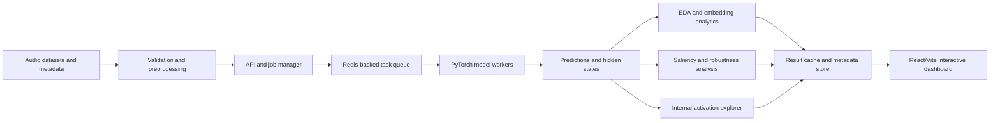

# In22-S5-CS3501 Data Science and Engineering Project

## Visual Interpretability and Diagnostic Tool for Speech Models

**Group ID:** 16  
**Project ID:** P01  
**Mentor:** Dr. Uthayasanker Thayasivam  
**Teaching Assistant:** Bawantha Madhushankha De Silva

### Team members

| Name | Registration number |
|---|---|
| LELWALA J.U.P. | 230374E |
| MAHANAMA K.J.C. | 230387V |
| MALLAWARACHCHI H.S. | 230394N |

> **Draft note:** Dataset sizes, performance thresholds, deployment target, and the final allocation of responsibilities should be confirmed after the initial feasibility study.

## 1. Executive summary

Modern speech models such as Whisper and Wav2Vec2 achieve strong performance in automatic speech recognition (ASR) and audio classification, but their internal decision processes remain difficult to inspect. Existing interpretability tools primarily target text, images, or tabular data, while speech introduces additional challenges: variable-length temporal signals, multiple acoustic representations, background noise, speaker variation, and a separation between acoustic encoding and textual decoding.

The existing ECHO prototype provides audio upload, predictions, embeddings, saliency maps, attention visualizations, and perturbations. However, its analyses are mainly file-level and visually descriptive. Its sequential request flow also limits batch analysis and can block the interface during expensive inference and attribution computations.

This project will extend ECHO into a scalable research workbench for diagnosing speech models at three levels. At the **dataset level**, it will provide exploratory data analysis, embedding-based clustering, retrieval, and anomaly detection. At the **prediction level**, it will quantify model robustness and evaluate whether saliency explanations are faithful and stable. At the **internal-representation level**, it will introduce a prototype Internal Activation and Acoustic Evidence Explorer for Whisper, displaying candidate lexical activations from decoder layers and tracing them to supporting encoder audio frames.

The platform will use an asynchronous job architecture, batch processing, containerized deployment, CI/CD, and a restricted adapter interface for supported Hugging Face audio models. The intended result is a reproducible research prototype that helps machine-learning practitioners identify dataset problems, model failure modes, unreliable explanations, and weakly grounded transcriptions.

## 2. Background and problem statement

Deep-learning speech models are commonly treated as black boxes. When an ASR model substitutes a phoneme, performs poorly for an accent, or generates text during silence, its output alone does not explain whether the failure arose from the recording, the acoustic encoder, the language decoder, or a spurious dataset pattern.

The existing ECHO system reveals several limitations that motivate this work:

1. **Operational bottlenecks:** Expensive tasks are executed through a largely sequential, in-request workflow. This limits concurrent use, makes batch processing difficult, and can leave the interface waiting for backend computation.
2. **Dataset-level analytical gaps:** Embedding projections can be viewed but not quantitatively queried. Users cannot automatically discover groups, retrieve similar recordings, measure class separability, or flag anomalous samples.
3. **Explanation gaps:** Saliency and attention are displayed mainly for individual recordings. Their faithfulness, stability, and population-level behaviour are not systematically evaluated.
4. **Limited model extensibility:** The prototype is coupled to a small number of predefined models and does not expose a safe, capability-based model-adapter interface.
5. **Limited internal diagnosis:** The system does not show how acoustic evidence in the encoder contributes to lexical candidates in the decoder.

The central problem is therefore not simply the absence of additional visualizations. It is the absence of a scalable and quantitatively evaluated workflow that connects dataset characteristics, model outputs, explanations, and internal representations.

## 3. Aim and objectives

### 3.1 Aim

To design and evaluate a scalable interactive platform for dataset-level, prediction-level, and internal-representation analysis of speech models.

### 3.2 Objectives

1. Refactor ECHO into an asynchronous, batch-capable, containerized architecture.
2. Develop dataset health diagnostics for class balance, duration, signal quality, and metadata completeness.
3. Add quantitative embedding analysis using clustering, class-separability measurement, nearest-neighbour retrieval, and outlier detection.
4. Evaluate model robustness under controlled acoustic and signal-processing perturbations.
5. Evaluate the faithfulness and stability of saliency explanations using quantitative baselines.
6. Develop a Whisper decoder activation viewer and connect decoder token candidates to encoder audio evidence.
7. Support a constrained set of Hugging Face speech-recognition and audio-classification architectures through a capability-based adapter interface.
8. Compare models and datasets side by side using consistent metrics and visualizations.

## 4. Research questions

- **RQ1:** Can embedding-based analytics identify meaningful groups, anomalous recordings, and useful neighbours in speech datasets?
- **RQ2:** How do controlled changes in noise, reverberation, pitch, speed, masking, and compression affect model performance and internal representations?
- **RQ3:** Do regions highlighted by audio saliency methods causally influence the corresponding model output more than randomly selected regions?
- **RQ4:** Are audio explanations stable when the prediction remains unchanged under small, label-preserving perturbations?
- **RQ5:** Can candidate lexical information be decoded from intermediate Whisper decoder states and traced to supporting encoder frames?
- **RQ6:** How much does asynchronous batch execution improve responsiveness and throughput over the existing sequential workflow?

## 5. Scope

### 5.1 Core scope

- Dataset upload, validation, preprocessing, and EDA.
- Whisper-based ASR and Wav2Vec2-based audio classification.
- Batch inference through asynchronous task queues.
- Side-by-side model and dataset comparison.
- Embedding clustering, retrieval, and anomaly analysis.
- Controlled robustness experiments.
- Saliency faithfulness and stability evaluation.
- Read-only decoder activation visualization and encoder evidence tracing for supported Whisper models.
- Containerized deployment and automated testing.

### 5.2 Stretch scope

- Suppression, amplification, or replacement of selected decoder activation directions.
- Encoder activation patching between paired recordings.
- Layer-wise probes for phonemes, speaker, accent, emotion, and noise.
- A focused accent or language fairness case study.

### 5.3 Out of scope

- Execution of arbitrary user-supplied Python model code.
- Guaranteed interpretability support for every Hugging Face audio model.
- Training large speech foundation models from scratch.
- Claiming that attention, saliency, or decoded activations reveal human-like thought or consciousness.
- Claiming the existence of a Whisper “J-space” without experimentally establishing equivalent properties.

## 6. Data description

The following datasets will be considered, with final subsets selected according to compute and licensing constraints:

1. **Mozilla Common Voice:** ASR evaluation across speakers, languages, and available accent metadata.
2. **L2-ARCTIC:** Non-native English speech for controlled accent-oriented ASR analysis.
3. **Speech Accent Archive:** Parallel or comparable spoken passages for side-by-side accent analysis, subject to usage conditions.
4. **RAVDESS:** Emotion classification and embedding-analysis baseline.
5. **Synthetic diagnostic data:** Clean recordings modified through noise injection, reverberation, masking, pitch shifting, time stretching, compression, or bandwidth restriction.
6. **User datasets:** Audio with optional transcripts, labels, speaker identifiers, and other metadata.

For each selected corpus, the final report will document its version, licence, sample count, speaker count, language/accent composition, class distribution, duration distribution, sampling rate, and missing metadata. Speaker-independent splits will be used wherever applicable to prevent speaker leakage.

## 7. Methodology

### 7.1 System architecture

The computational stages will form a dependency graph rather than an entirely parallel pipeline. Preprocessing and initial inference must occur first; independent analyses can then be scheduled concurrently, while perturbation experiments generate additional inference jobs. Parallelism will be introduced across recordings, models, datasets, and independent analysis branches while respecting GPU-memory limits.

### 7.2 Data validation and preprocessing

- Validate file type, duration, sampling rate, channel count, and decodability.
- Convert supported inputs to a consistent waveform representation required by each model.
- Detect missing labels, transcripts, and metadata.
- Identify duplicates and invalid or near-empty recordings.
- Compute duration, RMS energy, clipping ratio, silence ratio, estimated signal-to-noise indicators, and other selected quality measurements.
- Preserve the original recording and record each transformation for reproducibility.

### 7.3 Dataset exploratory analysis

The EDA module will provide:

- Class and subgroup distributions.
- Audio-duration distributions.
- Sampling-rate and channel distributions.
- Missing metadata summaries.
- Signal-quality summaries.
- Transcript length and word-frequency statistics for ASR datasets.
- Filters that connect EDA groups to prediction errors, embeddings, and recordings.

### 7.4 Models and prediction tasks

- **Sequence-to-sequence ASR:** Whisper-family models.
- **CTC ASR:** Compatible Wav2Vec2 or similar models.
- **Audio classification:** Wav2Vec2-compatible emotion or audio classifiers.

ASR outputs will include transcripts, token-level information where available, word error rate (WER), character error rate (CER), and error decomposition. Classification outputs will include predicted labels, class probabilities, calibration information, and confusion matrices.

### 7.5 Embedding analytics

Embeddings will be extracted from a documented model layer and pooled using a consistent strategy. They will be normalized before analysis. PCA may be used to reduce noise and computation before clustering, while UMAP or t-SNE will be used primarily for visualization.

- **HDBSCAN:** Discover density-based groups without preselecting the number of clusters.
- **Cluster evaluation:** Use Adjusted Rand Index (ARI) or Normalized Mutual Information (NMI) when reference labels exist, and Silhouette or DBCV-type internal criteria when they do not.
- **Cluster summaries:** Describe each cluster using dominant labels, accents, error rates, duration, and acoustic statistics. HDBSCAN itself will not be described as assigning semantic labels.
- **Nearest-neighbour retrieval:** Return similar recordings using cosine or another validated embedding distance.
- **Outlier detection:** Compare HDBSCAN outlier scores, Local Outlier Factor, or Isolation Forest on labelled or synthetically created anomalies.

Retrieval relevance will be defined by task. For example, same transcript/intent, same emotion class, or matched metadata may be used as reference relevance rather than assuming that embedding proximity is automatically semantic.

### 7.6 Robustness and linguistic-versus-acoustic analysis

Perturbations will be applied at controlled strengths:

- Additive background or Gaussian noise at defined signal-to-noise ratios.
- Reverberation using selected room impulse responses.
- Time and frequency masking.
- Pitch shifting and time stretching.
- Volume changes, clipping, compression, and bandwidth restriction.

The analysis will generate performance curves rather than relying on individual examples. Where possible, transformations will be selected to preserve linguistic content so that changes can be interpreted as sensitivity to acoustic or paralinguistic properties.

### 7.7 Saliency faithfulness and stability

The project will compare supported attribution approaches such as Integrated Gradients, GradientSHAP, and perturbation-based explanations. For each recording, the most highly attributed regions will be progressively removed or modified and the resulting output will be compared with equal-sized random and low-attribution regions.

Faithfulness will be measured using deletion/insertion behaviour, output-probability change, WER/CER change, comprehensiveness, sufficiency, or normalized perturbation metrics where applicable. Stability will be measured by comparing explanation rankings or overlap before and after small transformations that leave the prediction unchanged.

Population-level saliency will not be calculated by directly averaging variable-length maps. Explanations will first be aligned using word timestamps, phoneme boundaries where available, normalized utterance time, or fixed time-frequency regions. Aggregation can then be performed by prediction class, accent metadata, error type, or perturbation condition.

### 7.8 Internal Activation and Acoustic Evidence Explorer

The initial prototype will focus on Whisper because its encoder-decoder architecture separates acoustic processing from lexical generation.

1. Capture intermediate decoder hidden states during transcription.
2. Project compatible hidden states through the model's vocabulary projection to obtain layer-wise candidate-token readouts.
3. Display how token candidates evolve across decoder layers and decoding positions.
4. Extract decoder-to-encoder cross-attention and map a selected token to the most relevant encoder frames.
5. Convert those frames into waveform and spectrogram time intervals.
6. Compare acoustic grounding for correct words, substitutions, and hallucinated insertions.

The viewer will initially be observational. Candidate-token readouts and attention will be described as diagnostic associations, not automatically as causal explanations. Their validity will be tested through masking and controlled interventions. Decoder steering and encoder activation patching will be implemented only if feasibility and time permit.

### 7.9 Hallucination case study

A focused experiment will create or select low-volume speech, long pauses, silence, and noisy recordings. Unsupported inserted words will be identified by comparison with reference transcripts. The experiment will test whether hallucinated words show strong decoder activation but weak, diffuse, or silence-focused encoder evidence. This will be presented as a diagnostic case study rather than a complete hallucination detector unless the evaluation supports that claim.

### 7.10 Custom-model adapter framework

The initial release will support selected PyTorch models loadable through:

- `AutoModelForSpeechSeq2Seq`
- `AutoModelForCTC`
- `AutoModelForAudioClassification`

A compatible processor, feature extractor, or tokenizer must be available. Classification models must provide an `id2label` mapping, and speech-recognition models must provide a compatible tokenizer. Models must fit configured parameter-count, storage, memory, and inference-time limits.

User-supplied Python will not be executed, and models requiring `trust_remote_code=True` will be rejected. Basic prediction support does not imply support for every analysis. Capabilities such as hidden states, attentions, decoder analysis, and activation interventions will be detected and reported separately.

### 7.11 Software engineering methods

- Containerize the React/Vite frontend, FastAPI backend, Redis service, and background workers.
- Use Docker Compose for reproducible local orchestration.
- Add automated linting, unit tests, integration tests, and container-build checks through CI/CD.
- Use environment-based secret injection and avoid storing secrets in source control.
- Add rate limits, upload limits, model-size limits, and job timeouts.
- Cache deterministic results using model, dataset, configuration, and perturbation identifiers.
- Expose job states such as queued, running, completed, failed, and cancelled.

## 8. Evaluation plan

### 8.1 Data-science evaluation

| Capability | Metrics and comparisons |
|---|---|
| ASR | WER, CER, insertions, deletions, substitutions, subgroup results |
| Audio classification | Macro-F1, per-class recall, confusion matrix, calibration error or Brier score |
| Robustness | Performance against perturbation strength, area under degradation curve |
| Clustering | ARI/NMI with labels; Silhouette or DBCV without labels; cluster stability |
| Retrieval | Recall@5, Precision@5, mean average precision where suitable |
| Outlier detection | AUROC, average precision, or F1 on labelled/synthetic anomalies |
| Saliency faithfulness | Deletion/insertion curves, normalized AOPC or suitable output-change metrics, random baseline |
| Explanation stability | Rank correlation, top-k overlap, or time-region IoU under benign perturbations |
| Activation viewer | Layer-wise top-k token agreement, emergence layer, grounding concentration, comparison with random layers/frames |
| Hallucination case study | Unsupported insertion rate and acoustic-grounding measures under silence/noise conditions |

Statistical uncertainty will be reported using confidence intervals or repeated trials where applicable. Comparisons will use fixed datasets, model versions, preprocessing, random seeds, and hardware configurations.

### 8.2 System evaluation

- Compare sequential ECHO with the asynchronous implementation on the same hardware and workload.
- Measure job-submission latency, throughput, p50/p95 completion time, queue waiting time, failure rate, GPU/CPU utilization, and peak memory.
- Test increasing batch sizes and concurrent users using Locust or an equivalent load-testing tool.
- Verify that long-running jobs do not block navigation or unrelated result retrieval.
- Test container startup, health checks, worker recovery, task failure handling, cache behaviour, and CI/CD status.

### 8.3 Component and usability evaluation

- Unit-test preprocessing, metrics, perturbations, adapters, and result serialization.
- Integration-test upload-to-result workflows for each supported model category.
- Validate attention tensor shape, normalization, token/frame alignment, and repeatability before visualization.
- Conduct task-based usability testing with a small group of intended users if available. Example tasks include finding a dataset anomaly, comparing two models, and identifying the audio evidence associated with a transcription error.

## 9. Expected outcomes and deliverables

1. A containerized, deployable ECHO research prototype.
2. A non-blocking asynchronous job and batch-processing workflow.
3. Dataset EDA and quality diagnostics.
4. Quantitative embedding clustering, retrieval, and outlier tools.
5. Side-by-side model and dataset comparison.
6. Robustness curves under controlled audio perturbations.
7. Quantitative saliency faithfulness and stability reports.
8. A Whisper decoder activation viewer linked to encoder audio evidence.
9. A restricted Hugging Face model-adapter framework.
10. Automated tests, experiment configurations, technical documentation, and a final evaluation report.

## 10. Success criteria

The project will be considered successful if:

1. The frontend, backend, Redis queue/cache, and workers can be launched reproducibly through container orchestration.
2. Batch jobs execute without blocking the interactive client, and performance is reported against the existing sequential baseline under a fixed workload.
3. At least one model from each selected core task category completes the supported end-to-end analyses.
4. Embedding analysis returns reproducible clusters, neighbours, and outlier scores, with quantitative evaluation against suitable labels or synthetic anomalies.
5. Robustness results report model degradation across multiple controlled perturbation strengths.
6. Saliency explanations are compared against random and low-saliency baselines using at least one faithfulness and one stability metric.
7. The activation viewer displays layer-wise Whisper token candidates and maps selected output tokens to time-aligned encoder evidence.
8. Unsupported model capabilities are detected and communicated without crashing the application.

Numerical system-performance targets will be finalized after a pilot benchmark on the available hardware. This avoids promising a throughput value that is incompatible with the selected model size or compute device.

## 11. Risks and mitigation

| Risk | Mitigation |
|---|---|
| Scope exceeds the semester | Separate core and stretch objectives; deliver read-only activation analysis before causal interventions |
| Attribution computations are slow or run out of memory | Limit duration and batch size, queue jobs, cache results, provide approximate modes |
| UMAP/t-SNE creates misleading visual clusters | Cluster in a documented analytical space and use projections mainly for visualization |
| Saliency masking produces out-of-distribution audio | Compare multiple replacement strategies and random controls; report this limitation |
| Cross-attention is not a faithful explanation | Treat it as an association and evaluate it through output-targeted perturbation |
| Custom models execute unsafe code | Reject remote custom code, enforce supported classes and resource limits |
| Dataset licences limit redistribution | Document licences and provide download/preparation instructions rather than redistributing restricted data |
| Accent or speaker analysis causes overgeneralization | Report subgroup sizes and uncertainty; avoid biological or ability-based conclusions from accent labels |
| Internal-word projection is architecture-dependent | Restrict the first version to validated Whisper models and expose capability flags |

## 12. Ethical and privacy considerations

Voice recordings can reveal identity, accent, emotion, health, and demographic information. The system will avoid collecting unnecessary personal information, document dataset consent and licence conditions, and prevent public exposure of uploaded data by default. Uploaded recordings and model artifacts will be isolated by session where supported and governed by configurable retention limits.

Fairness analyses will be framed as model-behaviour audits, not as claims about the inherent abilities of speaker groups. Small subgroup results and uncertain metadata will be explicitly identified. Interpretability outputs will include warnings that visual plausibility does not establish causal faithfulness.

## 13. Proposed division of work

The following allocation is a sample and should be adjusted to team preferences.

### LELWALA J.U.P. — Platform and model integration

- Containerization and CI/CD.
- Task queue, workers, batch execution, and job-state API.
- Custom-model adapter framework and capability detection.
- Performance, security, and integration testing.

### MAHANAMA K.J.C. — Dataset and robustness analytics

- Data validation and EDA.
- Embedding extraction, clustering, retrieval, and outlier detection.
- Perturbation framework and robustness evaluation.
- Model/dataset comparison views and metrics.

### MALLAWARACHCHI H.S. — Interpretability research

- Saliency faithfulness and explanation stability.
- Population-level saliency aggregation.
- Internal Activation and Acoustic Evidence Explorer.
- Hallucination case study and attention validation.

### Shared responsibilities

- Requirements and architecture decisions.
- Frontend integration and usability.
- Experiment design and statistical analysis.
- Testing, documentation, report writing, and presentation.

## 14. Indicative timeline

| Phase | Weeks | Activities |
|---|---:|---|
| Requirements and baseline | 1–2 | Finalize datasets, models, metrics, architecture; benchmark existing ECHO |
| Platform foundation | 3–4 | Containers, queue, workers, job states, CI/CD |
| Dataset analytics | 4–6 | EDA, embeddings, clustering, retrieval, outliers |
| Robustness and comparison | 6–8 | Perturbation experiments, model/dataset comparison |
| Explanation evaluation | 7–9 | Faithfulness, stability, population aggregation |
| Activation explorer | 8–10 | Decoder readouts, cross-attention evidence tracing, validation |
| Integration and evaluation | 10–11 | Load tests, experiment runs, usability tasks, bug fixes |
| Finalization | 12 | Documentation, final report, deployment, demonstration |

## 15. Preliminary bibliography

1. I. Tenney et al., “The Language Interpretability Tool: Extensible, Interactive Visualizations and Analysis for NLP Models,” EMNLP System Demonstrations, 2020.
2. Google PAIR, [Learning Interpretability Tool](https://pair-code.github.io/lit/).
3. A. Radford et al., [“Robust Speech Recognition via Large-Scale Weak Supervision,”](https://arxiv.org/abs/2212.04356) 2022.
4. A. Baevski et al., [“wav2vec 2.0: A Framework for Self-Supervised Learning of Speech Representations,”](https://arxiv.org/abs/2006.11477) 2020.
5. E. Pastor et al., [“Explaining Speech Classification Models via Word-Level Audio Segments and Paralinguistic Features,”](https://aclanthology.org/2024.eacl-long.136/) EACL, 2024.
6. V. Haunschmid, E. Manilow, and G. Widmer, [“audioLIME: Listenable Explanations Using Source Separation,”](https://arxiv.org/abs/2008.00582) 2020.
7. J. Edin et al., [“Normalized AOPC: Fixing Misleading Faithfulness Metrics for Feature Attributions Explainability,”](https://aclanthology.org/2025.acl-long.86/) ACL, 2025.
8. A. Koenecke et al., [“Careless Whisper: Speech-to-Text Hallucination Harms,”](https://arxiv.org/abs/2402.08021) 2024.
9. Anthropic, [“A Global Workspace in Language Models,”](https://www.anthropic.com/research/global-workspace) 2026. Used as inspiration for internal activation analysis; this project does not assume that Whisper contains an equivalent J-space.
10. R. Ardila et al., “Common Voice: A Massively-Multilingual Speech Corpus,” LREC, 2020.
11. G. Zhao et al., “L2-ARCTIC: A Non-native English Speech Corpus,” Interspeech, 2018.
12. S. R. Livingstone and F. A. Russo, “The Ryerson Audio-Visual Database of Emotional Speech and Song (RAVDESS),” PLOS ONE, 2018.
13. L. McInnes, J. Healy, and J. Melville, [“UMAP: Uniform Manifold Approximation and Projection for Dimension Reduction,”](https://arxiv.org/abs/1802.03426) 2018.
14. L. McInnes, J. Healy, and S. Astels, [“hdbscan: Hierarchical Density Based Clustering,”](https://joss.theoj.org/papers/10.21105/joss.00205) Journal of Open Source Software, 2017.
15. Captum, [Model Interpretability for PyTorch](https://captum.ai/).
